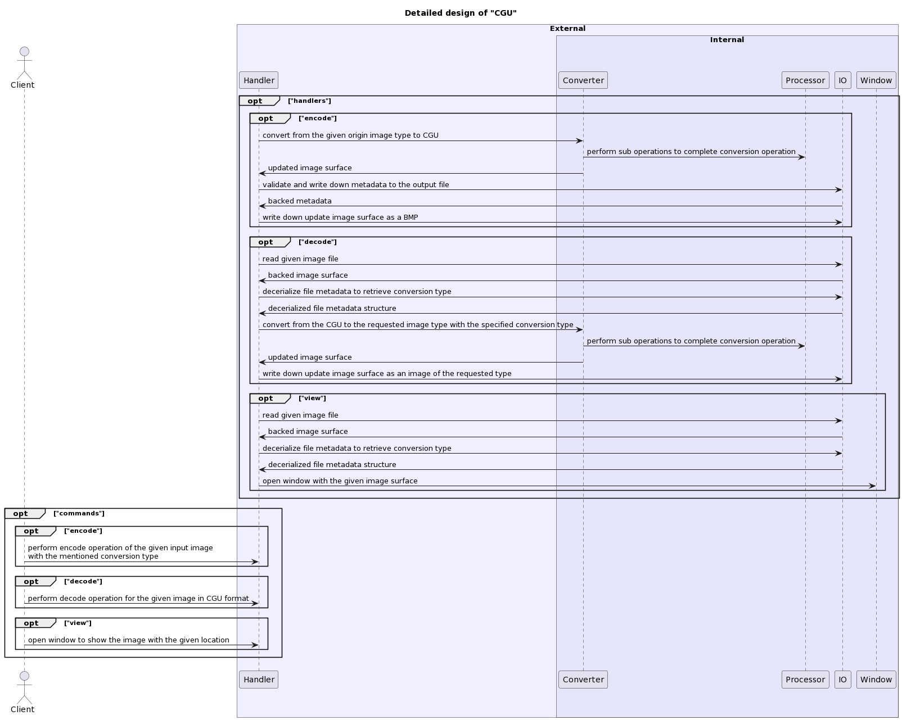
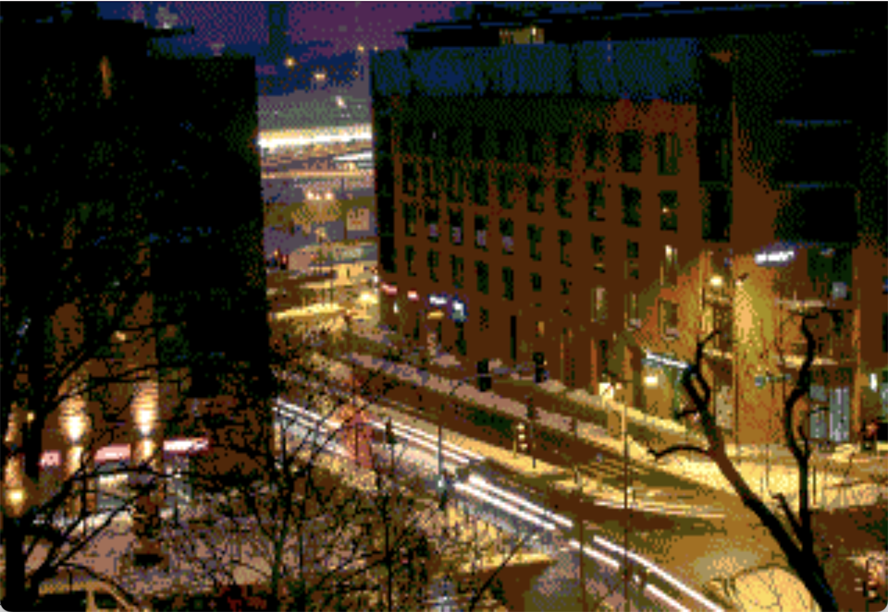
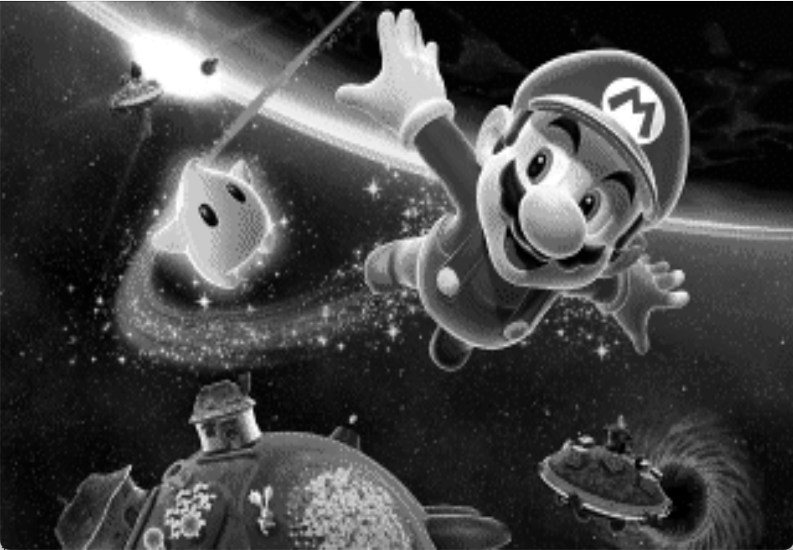
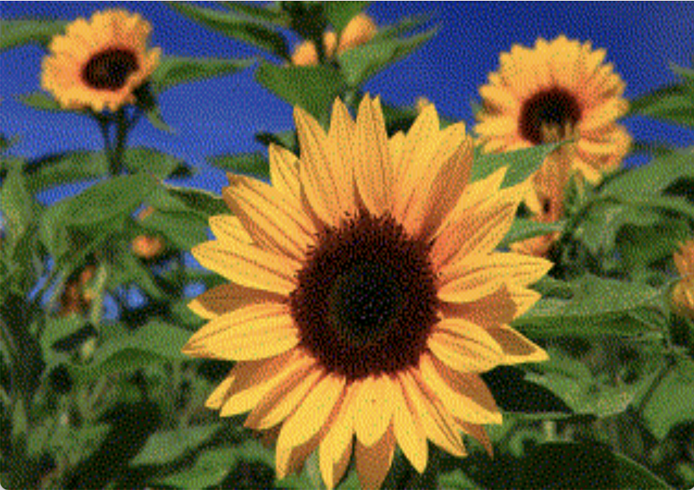
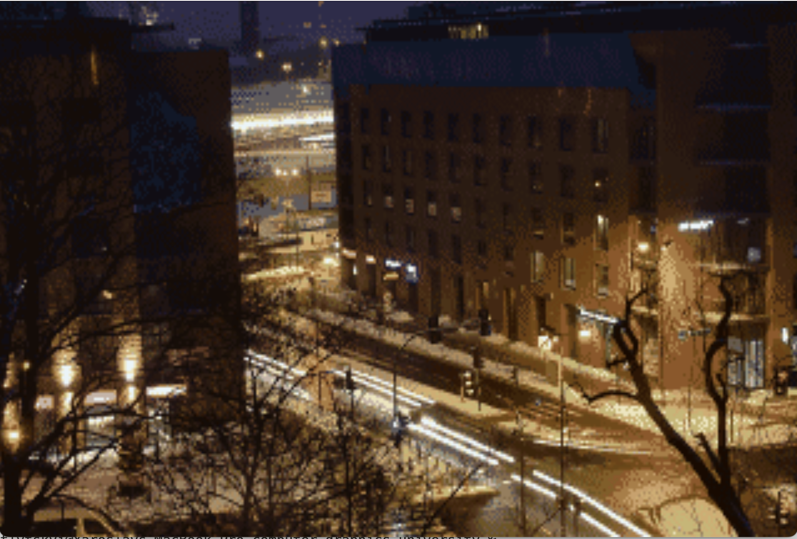
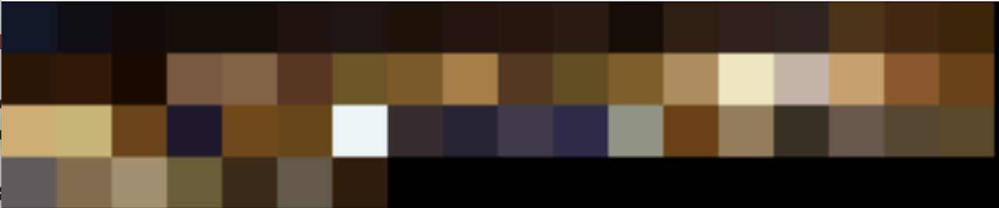
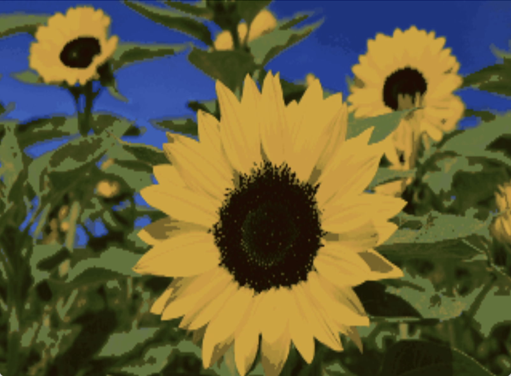

# computer-graphics-university

[](https://github.com/YarikRevich/computer-graphics-university/actions/workflows/build.yml)
[](https://github.com/vshymanskyy/StandWithUkraine/blob/main/docs/README.md)

## General Information

Media codec with the possibility of result representation.



## Setup

### Prerequisites

In the case of the usage with MacOS operational systems it's important to remember to allow the usage of SDL2 library on your local machine using privacy settings. 

### Installation
All setup related operations are processed via **Makefile**(which operates **CMake** configurations) placed in the root directory.

In order to build the application into project local **bin** library it's required to execute the following command.
```shell
make build
```

## Specification

### Metadata

All the output images of CGU type have **metadata** part, which is located after **EOF** flag. It's used for internal CGU properties
interpretation and its further usage as parameters for different kind of operations.

**It's important to remember, that all the metadata values are defined with the new line flag!**

All the available **metadata** flags:

| Name      | Offset | Size | Description | Mandatory |
| ----------- | ----------- | ----------- | ----------- | ----------- |
| Compatibility      | 1 |  1 byte  |       Compatibility flag, which is required to be present, <br />so CGU can perform decode operation   |    <center>true</center>     |
| Conversion   | 2 | 1 byte  |      Describes conversion type used for image encoding       |   <center>true</center>    |
| Width   | 4 | 2 bytes  |      Describes image width       |   <center>true</center>    |
| Height   | 6 | 2 bytes  |      Describes image height       |   <center>true</center>    |
| Dithering   | 7 | 1 bytes  |      Describes if dithering is enabled for the image encoding       |   <center>true</center>    |
| Indeces size   | 11 |   4 bytes     |    Represents size of the given color indeces    |   <center>false</center>   | 
| Indeces   | 11 + (4 * N) | 4 bytes * N        |    Represents color indeces generated for palette conversions          |   <center>false</center>   | 

### Native conversion

Every pixel has **7-bit** color. That color consists of the following compounds:
* 4 states for **RED** color.
* 8 states for **GREEN** color.
* 4 states for **BLUE** color.

The general color is equal to **RRGGGBB**.

> ### RGB

The values of **RED** and **BLUE** compounds look like this:
* 0 - 0
* 1 - 85
* 2 - 170
* 3 - 255

The values of **GREEN** compound look like this:
* 0 - 0
* 1 - 36
* 2 - 73
* 3 - 109
* 4 - 146
* 5 - 182
* 6 - 218
* 7 - 255



> ### BW

All the values are interpreted as an intensity of a grey scale, where **0** means the color is **black** and **255** means that the color is **white**.



> ### Dithering

Both RGB and BW support additional feature, which is called **dithering**. 

> Dithering - an intentionally applied form of noise used to randomize quantization error, preventing large-scale patterns such as color banding in images

In the case of native conversion there are the next possible options of dithering algorithm to be used:
* **Floyd-Steinberg**



### Palette conversion

In order to perform color conversion it's required to have generated reduced bit color map of the colors
of the source image. It should not exceed **128** colors. 

> ### Detected palette conversion

Detected palette conversion uses previously generated bit color map, but renders only palette colors themselves. Each color is placed in a rectangle, which are evenly spaced in the whole image surface.





> ### MedianCut

**MedianCut** is the algorithm used for the color quantization operation. With the help of the generated **7-bit** color palette saved in the metadata header and indeces placed as data image, it can process the given image and return the generated one.

> **MedianCut** algorithm has a restriction. It works only if the given image has at least **128** unique colors.

> ### RGB



> ### BW


### Image data

Image data is placed under the metadata header, after the offset(11 + (4 * N)). All the data is written in the HEX notation, but can be converted to usual **RGB**.

**RGB** color chunk for **Native RGB** looks in the following way.
```
RGB(0, 36, 85)
RGB(0, 0, 85)
RGB(0, 36, 0)
RGB(0, 0, 85)
RGB(0, 0, 85)
RGB(0, 36, 85)
RGB(0, 0, 85)
RGB(0, 36, 85)
```

**RGB** color chunk for **Native BW**(grey scale) looks in the following way.
```
RGB(7, 7, 7)
RGB(12, 12, 12)
RGB(40, 40, 40)
RGB(78, 78, 78)
RGB(153, 153, 153)
RGB(172, 172, 172)
RGB(78, 78, 78)
RGB(136, 136, 136)
```

### Data collection

Image data consists of chunks. Each chunk has 8 pixels. The whole chunk size of **7 byte**. The sequence of retrieved raw data chunks looks like this:
```
(0, 8), (8, 15), (15, 23), ...
```

Each chunk is written in the new line. Output structure looks like this:
```
(1, 8)
(2, 8)
(3, 8)
...
```

During the decoding process the chunk column is decerialized into row based one, which was known during the encoding process.

## Use cases

### Encoding

In order to encode input image, it should be of the supported extension type:
* **jpeg**
* **jpg**
* **png**
* **bmp**

Codec obliges to select **conversion** mode during encoding operation:
* **native_colorful**
* **native_bw**
* **palette_colorful**
* **palette_bw**

Also, there is an option to enable **dithering** mode during the encoding operation. This mode will enable the usage of **Floyd-Steinberg** dithering algorithm. To enable it, it's required to add **--dithering** flag.

> ### Examples

The encoding for **BMP** to **CGU** with **palette_colorful** command looks like this:

```shell
./bin/cgu encode --from="./examples/1.bmp" --type=bmp --conversion=palette_colorful --to="1.cgu"
```

The encoding for **BMP** to **CGU** with **native_colorful** command looks like this:

```shell
./bin/cgu encode --from="./examples/2.bmp" --type=bmp --conversion=native_colorful --dithering --to="2.cgu"
```

### Decoding

In order to decode input image, it should be of **CGU** extension.

Output image can be one of the following extensions:
* **jpeg**
* **jpg**
* **png**
* **bmp**

Codec obliges to select **conversion** mode during decoding operation:
* **native_colorful**
* **native_bw**
* **palette_colorful**
* **palette_bw**

Also, there is an option to enable **debug** mode during the encoding operation. This mode will enable **dedicated palette** overlay. 
To enable it, it's required to add **--dithering** flag.

The decoding for **BMP** to **CGU** with **palette_colorful** command looks like this:

```shell
./bin/cgu decode --from="./1.cgu" --type=bmp --to="1.bmp"
```

The decoding for **BMP** to **CGU** with **native_colorful** command looks like this:

```shell
./bin/cgu decode --from="./2.bmp" --type=bmp --to="2.bmp"
```

The decoding for **BMP** to **CGU** with **native_colorful** command and **--debug** flag looks like this:

```shell
./bin/cgu decode --from="./2.bmp" --type=bmp --to="2.bmp" --debug
```

### Viewer

Viewer mode enables user to preview **CGU** encoded images. 

The viewer command for **CGU** encoded image looks like this:

```shell
./bin/cgu view --from="1.cgu"
```

The viewer command for **CGU** encoded image with **--debug** flag looks like this:

```shell
./bin/cgu view --from="1.cgu" --debug
```