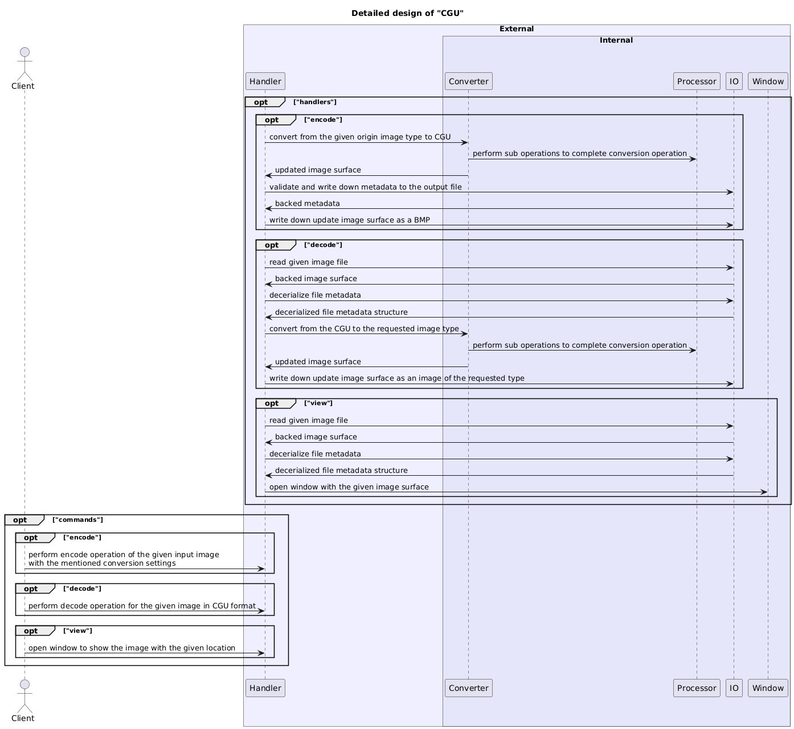
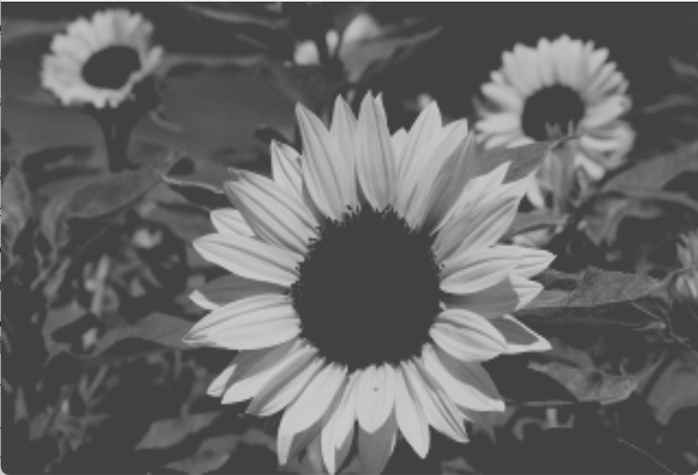
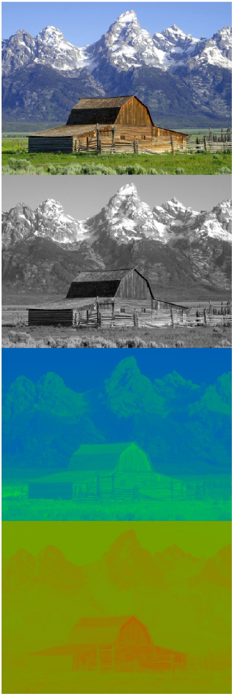
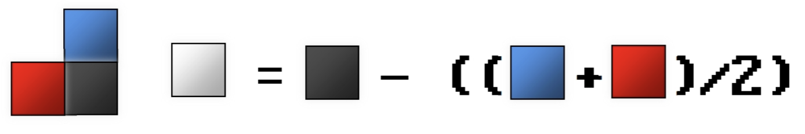

# computer-graphics-university

[](https://github.com/YarikRevich/computer-graphics-university/actions/workflows/build.yml)
[](https://github.com/vshymanskyy/StandWithUkraine/blob/main/docs/README.md)

## General Information

Media codec with the possibility of result representation.



## Setup

### Prerequisites

In the case of the usage with MacOS operational systems it's important to remember to allow the usage of SDL2 library on your local machine using privacy settings. 

### Installation
All setup related operations are processed via **Makefile**(which operates **CMake** configurations) placed in the root directory.

In order to build the application into project local **bin** library it's required to execute the following command.
```shell
make build
```

## Specification

### Metadata

All the output images of CGU type have **metadata** part, which is located after **EOF** flag. It's used for internal CGU properties
interpretation and its further usage as parameters for different kind of operations.

**It's important to remember, that all the metadata values are defined with the new line flag!**

All the available **metadata** flags:

| Name      | Offset | Size | Description | Mandatory |
| ----------- | ----------- | ----------- | ----------- | ----------- |
| Compatibility      | 1 |  1 byte  |       Compatibility flag, which is required to be present, <br />so CGU can perform decode operation   |    <center>true</center>     |
| Conversion   | 2 | 1 byte  |      Describes conversion type used for image encoding       |   <center>true</center>    |
| Bit   | 3 | 1 byte  |      Describes bit  type used for image encoding       |   <center>true</center>    |
| Model   | 4 | 1 byte  |      Describes model type used for image encoding       |   <center>true</center>    |
| Lossless compression   | 5 | 1 byte  |      Describes lossless compression type used for image encoding       |   <center>true</center>    |
| Lossless compression size   | 9 | 4 bytes  |      Describes image size after lossless compression       |   <center>true</center>    |
| Lossy compression   | 10 | 1 byte  |      Describes lossy compression type used for image encoding       |   <center>true</center>    |
| Sampling   | 11 | 1 byte  |      Describes sub sampling type used for image encoding       |   <center>true</center>    |
| Filter   | 12 | 1 byte  |      Describes filter type used for image encoding       |   <center>true</center>    |
| Width   | 14 | 2 bytes  |      Describes image width       |   <center>true</center>    |
| Height   | 16 | 2 bytes  |      Describes image height       |   <center>true</center>    |
| Dithering   | 17 | 1 bytes  |      Describes if dithering is enabled for the image encoding       |   <center>true</center>    |
| Indeces size   | 21 |   4 bytes     |    Represents size of the given color indeces    |   <center>true</center>   | 
| Indeces   | 21 + (4 * N) | 4 bytes * N        |    Represents color indeces generated for palette conversions          |   <center>false</center>   | 

> It's important to notice that all the previous versions are not compatible with the latest one. This is controlled by the **compatibility** flag in the set of metadata properties.

### Native conversion

During native conversion colors are retrieved without any mappings.

> #### Colorful


> #### BW

All the values are interpreted as an intensity of a grey scale, where **0** means the color is **black** and **255** means that the color is **white**.


Image data is placed in a form of raw bytes. Those bytes would be used for direct image conversion.

### Palette conversion

In order to perform color conversion it's required to have generated reduced bit color map of the colors
of the source image. It should not exceed **128** colors. 

> #### MedianCut

**MedianCut** is the algorithm used for the color quantization operation. With the help of the generated **7-bit** color palette saved in the metadata header and indeces placed as data image, it can process the given image and return the generated one.

> **MedianCut** algorithm has a restriction. It works only if the given image has at least **128** unique colors.

> ##### Colorful


> ##### BW



Image data is placed in a form of indeces related to colors set in the metadata header. Those indeces would be used for color mapping conversion during decoding operation.

### Color models

Describes the color model of which colors are interpreated during the process of image conversion.

#### RGB

The default color model, which consists of **3** color compounds, which represent **red**, **green**, **blue** spectres of color.

Color chunk for **Colorful** looks in the following way:
```
RGB(0, 36, 85)
RGB(0, 0, 85)
RGB(0, 36, 0)
RGB(0, 0, 85)
RGB(0, 0, 85)
RGB(0, 36, 85)
RGB(0, 0, 85)
RGB(0, 36, 85)
```

Color chunk for **BW**(grey scale) looks in the following way:
```
RGB(7, 7, 7)
RGB(12, 12, 12)
RGB(40, 40, 40)
RGB(78, 78, 78)
RGB(153, 153, 153)
RGB(172, 172, 172)
RGB(78, 78, 78)
RGB(136, 136, 136)
```

#### YUV

It's a color model, in which **Y** represents brightness and other two compounds represent chromes.

Range of values:
* Y: 0 to 1
* U: -0.436 to 0.436
* V: -0.615 to 0.615

Color chunk for **Colorful** looks in the following way:
```
YUV(0.4, -0.121, 0.231)
YUV(0.12, 0.321, -0.231)
YUV(0.94, -0.312, -0.513)
```

Color chunk for **BW**(grey scale) looks in the following way:
```
YUV(0.4, 0, 0)
YUV(0.12, 0, 0)
YUV(0.94, 0, 0)
```



#### YIQ

It's a color model, in which **Y** represents brightness and other two compounds represent chromes.

Range of values:
* Y: 0 to 1
* I: -0.5959 to 0.5959
* Q: -0.5227 to 0.5227

Color chunk for **Colorful** looks in the following way:
```
YIQ(0.4, -0.2313, 0.5132)
YIQ(0.12, 0.4233, -0.2323)
YIQ(0.94, -0.3123, -0.5139)
```

Color chunk for **BW**(grey scale) looks in the following way:
```
YIQ(0.4, 0, 0)
YIQ(0.12, 0, 0)
YIQ(0.94, 0, 0)
```


#### YCbCr

It's a color model, in which **Y** represents brightness and other two compounds represent differential chromes.

Range of values:
* Y: 16 to 235
* Cb: 16 to 240
* Cr: 16 to 240

Color chunk for **Colorful** looks in the following way:
```
YCbCr(18, 179, 203)
YCbCr(120, 115, 132)
YCbCr(210, 143, 210)
```

Color chunk for **BW**(grey scale) looks in the following way:
```
YCbCr(18, 128, 128)
YCbCr(120, 128, 128)
YCbCr(210, 128, 128)
```


#### HSL

It's a color model, in which:
* H: a color shade
* S: a color saturation
* L: a color bridgtness

**Y** represents brightness and other two compounds represent differential chromes.

Range of values:
* H: 0 to 360
* S: 0 to 1
* L: 0 to 1

Color chunk for **Colorful** looks in the following way:
```
HSL(100, 0.8313, 0.5323)
HSL(245, 0.4233, 0.2323)
HSL(315, 0.9223, 0.5139)
```

Color chunk for **BW**(grey scale) looks in the following way:
```
HSL(0, 0, 0.5323)
HSL(0, 0, 0.2323)
HSL(0, 0, 0.5139)
```


### Bit types

Bit types chooses the way raw image data is interpreted. It can be packed in a chunk of the declared size or some byte package.

#### 7 bit

Image data consists of chunks. Each chunk has 8 pixels. The whole chunk size of **7 bytes**. The sequence of retrieved raw data chunks looks like this:
```
(0, 8), (8, 15), (15, 23), ...
```

Each chunk is written in the new line. Output structure looks like this:
```
(1, 8)
(2, 8)
(3, 8)
...
```

During the decoding process the chunk column is decerialized into row based one, which was known during the encoding process.

Every pixel has **7-bit** color. That color consists of the following compounds:
* 4 states for **RED** color.
* 8 states for **GREEN** color.
* 4 states for **BLUE** color.

The general color is equal to **RRGGGBB**.

The values of **RED** and **BLUE** compounds look like this:
* 0 - 0
* 1 - 85
* 2 - 170
* 3 - 255

The values of **GREEN** compound look like this:
* 0 - 0
* 1 - 36
* 2 - 73
* 3 - 109
* 4 - 146
* 5 - 182
* 6 - 218
* 7 - 255

#### 15 bit

Image data consists of byte packages. Each package has one pixel of **3** color compounds compressed to be of **15 bytes** size. The sequence of retrieved raw data is not changed in any way.

Each byte package is written in the new line.

During the decoding process the chunk column is decerialized into row based one, which was known during the encoding process.

Every pixel has **15-bit** color. That color consists of the following compounds:
* 5 states for the **RED** color.
* 5 states for the **GREEN** color.
* 5 states for the **BLUE** color.

The general color format is **RRRRRGGGGGBBBBB**.

The values for each compound (**RED**, **GREEN**, and **BLUE**) are as follows:
* 0 - 0
* 1 - 8
* 2 - 17
* 3 - 25
* 4 - 34
* 5 - 42
* 6 - 51
* 7 - 59
* 8 - 68
* 9 - 76
* 10 - 85
* 11 - 93
* 12 - 102
* 13 - 110
* 14 - 119
* 15 - 127
* 16 - 136
* 17 - 144
* 18 - 153
* 19 - 161
* 20 - 170
* 21 - 178
* 22 - 187
* 23 - 195
* 24 - 204
* 25 - 212
* 26 - 221
* 27 - 229
* 28 - 238
* 29 - 246
* 30 - 255

#### 16 bit

Image data consists of byte packages. Each package has one pixel of **3** color compounds compressed to be of **16 bytes** size. The sequence of retrieved raw data is not changed in any way.

Each byte package is written in the new line.

During the decoding process the chunk column is decerialized into row based one, which was known during the encoding process.

Every pixel has **16-bit** color. That color consists of the following compounds:
* 6 states for the **RED** color.
* 5 states for the **GREEN** color.
* 5 states for the **BLUE** color.

The general color format is **RRRRRRGGGGGBBBBB**.

The values for **RED** compound are:
* 0 - 0
* 1 - 4
* 2 - 8
* 3 - 12
* 4 - 16
* 5 - 20
* 6 - 24
* 7 - 28
* 8 - 32
* 9 - 36
* 10 - 40
* 11 - 44
* 12 - 48
* 13 - 52
* 14 - 56
* 15 - 60
* 16 - 64
* 17 - 68
* 18 - 72
* 19 - 76
* 20 - 80
* 21 - 84
* 22 - 88
* 23 - 92
* 24 - 96
* 25 - 100
* 26 - 104
* 27 - 108
* 28 - 112
* 29 - 116
* 30 - 120
* 31 - 124
* 32 - 128
* 33 - 132
* 34 - 136
* 35 - 140
* 36 - 144
* 37 - 148
* 38 - 152
* 39 - 156
* 40 - 160
* 41 - 164
* 42 - 168
* 43 - 172
* 44 - 176
* 45 - 180
* 46 - 184
* 47 - 188
* 48 - 192
* 49 - 196
* 50 - 200
* 51 - 204
* 52 - 208
* 53 - 212
* 54 - 216
* 55 - 220
* 56 - 224
* 57 - 228
* 58 - 232
* 59 - 236
* 60 - 240
* 61 - 244
* 62 - 248
* 63 - 252
* 64 - 255

The values for **GREEN** and **BLUE** are the same as for **15 bit**.

#### 24 bit

Image data consists of byte packages. Each package has one pixel of **3** color compounds written in native byte size, but as an array. The sequence of retrieved raw data is not changed in any way.

Each byte package is written in the new line. Output structure looks like this:
```
(1, 3)
(2, 3)
(3, 3)
...
```

### Subsampling

Subsampling is a method of lowering the amount of colors used in the image.

#### 4:2:0

In this technique four pixels are combined into one and then those four pixels are overwritten.


##### RGB

For this color model all the compounds are used for sampling operation.

##### YUV

For this color model **U** and **V** compounds are used for sampling operation.

##### YIQ

For this color model **I** and **Q** compounds are used for sampling operation.

##### YCbCr

For this color model **Cb** and **Cr** compounds are used for sampling operation.

##### HSL

For this color model only **L** compound is used for sampling operation.


### Lossless compression

Lossless compression is supposed to lower the size of the image without any quality losses.

#### ByteRun

**ByteRun** compression is a form of run-length encoding that compresses data by replacing consecutive identical bytes (runs) with a pair: a length byte and the repeated byte. Non-repeating sequences are stored with a negative length byte followed by the sequence itself, making it efficient for data with many repeated or predictable patterns

#### RLE

**RLE** compresses data by representing consecutive repeated symbols as a pair: the count of repetitions and the symbol itself. 

#### LZ77

**LZ77** replaces repeated sequences in data with references to earlier occurrences within a sliding window buffer. Each reference consists of a distance and a length, reducing redundancy efficiently.

#### LZW

**LZW** builds a dictionary of patterns encountered in the data. Instead of storing raw data, it replaces sequences with indexes into this dictionary, which grows dynamically during compression, making it effective for repetitive and structured data.

### Lossy compression

Lossy compression is supposed to be used in a pair with lossless compression to make compression effect more visible.

#### DCT

The Discrete Cosine Transform(**DCT** in short) is a mathematical technique used in signal and image processing. It converts data like pixel values or sound samples into a set of frequency components.

**DCT** needs data to be separated into blocks, which are then converted into a series of cosine wave component each representing a specific frequency.

The result is a set of coefficients. The first coefficient represents details and variations. High-frequency coefficients, which contribute less to the overall data, can be discarded, reducing the file size with minimal quality loss.

The original data can be recreated using inverse **DCT**, which combines the cosine components.

### Filters

Predictional filters can be applied during Palette conversion and are used in order to make compression algorithms more efficient.

#### Differential

A differential predictive filter compresses data by storing the difference between consecutive values instead of the actual values. This reduces redundancy by representing predictable patterns as smaller differences, which can then be efficiently encoded.


#### Line difference

The line difference filter compresses image data by storing the difference between each pixel and the pixel directly above it. This is effective in reducing redundancy in images with consistent horizontal patterns.


#### Average

The average filter compresses data by storing the difference between a pixel and the average of the pixel to its left and the one above it. It works well for images with gradual changes in color or intensity.



#### Paeth

The **Paeth** filter predicts a pixel’s value based on the pixel to its left, above, and upper-left. It selects the predictor closest to the actual pixel value, then stores the difference, optimizing compression for natural images.


### Dithering

Both RGB and BW support additional feature, which is called **dithering**. 

> Dithering - an intentionally applied form of noise used to randomize quantization error, preventing large-scale patterns such as color banding in images

In the case of native conversion there are the next possible options of dithering algorithm to be used:
* **Floyd-Steinberg**


### Dedicated palette conversion

Detected palette conversion uses previously generated bit color map, but renders only palette colors themselves. Each color is placed in a rectangle, which are evenly spaced in the whole image surface.


## Use cases

### Encoding

In order to encode input image, it should be of the supported extension type:
* **jpeg**
* **jpg**
* **png**
* **bmp**

Codec obliges to select **conversion** mode during encoding operation:
* **native_colorful**
* **native_bw**
* **palette_colorful**
* **palette_bw**

Also, it's required to set **bit** mode:
* **7**
* **15**
* **16**
* **24**

Additionally, it's mandatory to set **model** mode:
* **rgb**
* **ycbcr**
* **yiq**
* **yuv**
* **hsl**

Also, there is an option to enable **dithering** mode during the encoding operation. This mode will enable the usage of **Floyd-Steinberg** dithering algorithm. To enable it, it's required to add **--dithering** flag.

Codec supports subsampling, which can be selected by **sampling** option:
* **four_two_one**

It's possible to select **lossless_compression** mode:
* **byterun**
* **rle**
* **lzw**
* **lz77**

Predictional filters can be enabled with **filter** option(availabe only for **palette_bw** or **palette_colorful** conversion types):
* **differential**
* **line_difference**
* **average**
* **paeth**

Additionally, it's possible to select **lossy_compression** mode(available only for **palette_bw** or **palette_colorful** conversion types):
* **dct**

> ### Examples

The encoding for **BMP** to **CGU** with **palette_colorful**, **7 bit**, **RGB** command looks like this:

```shell
./bin/cgu encode --from="./examples/1.bmp" --type=bmp --conversion=palette_colorful --to="1.cgu" --bit=7 --model=rgb
```

The encoding for **BMP** to **CGU** with **native_colorful**, **7 bit**, **RGB** and **dithering** enabled command looks like this:

```shell
./bin/cgu encode --from="./examples/2.bmp" --type=bmp --conversion=native_colorful --to="2.cgu" --bit=7 --model=rgb --dithering 
```

The encoding for **BMP** to **CGU** with **palette_colorful**, **4:2:0** sampling, **average** filter, **ByteRun** losslessCompression, **DCT** lossyCompression, **16 bit**, **RGB** and **dithering** enabled command looks like this:

```shell
./bin/cgu encode --from="./examples/3.bmp" --type=bmp --conversion=palette_colorful --to="3.cgu" --bit=16 --model=rgb --sampling=four_two_one --filter=average --losslessCompression=byterun --lossyCompression=dct
```

The encoding for **BMP** to **CGU** with **palette_bw**, **4:2:0** sampling, **average** filter, **RLE** losslessCompression, **DCT** lossyCompression, **24 bit**, **HSL** and **dithering** enabled command looks like this:

```shell
./bin/cgu encode --from="./examples/4.bmp" --type=bmp --conversion=palette_bw --to="4.cgu" --bit=24 --model=hsl --sampling=four_two_one --filter=average --losslessCompression=rle --lossyCompression=dct
```

The encoding for **BMP** to **CGU** with **native_bw**, **4:2:0** sampling, **RLE** losslessCompression, **15 bit**, **YIQ** and **dithering** enabled command looks like this:

```shell
./bin/cgu encode --from="./examples/5.bmp" --type=bmp --conversion=native_bw --to="5.cgu" --bit=15 --model=yiq --sampling=four_two_one --losslessCompression=rle
```

### Decoding

In order to decode input image, it should be of **CGU** extension.

Output image can be one of the following extensions:
* **jpeg**
* **jpg**
* **png**
* **bmp**

The decoding for **BMP** to **CGU** command looks like this:

```shell
./bin/cgu decode --from="./1.cgu" --type=bmp --to="1.bmp"
```

The decoding for **BMP** to **CGU** command and **--debug** flag looks like this:

```shell
./bin/cgu decode --from="./2.bmp" --type=bmp --to="2.bmp" --debug
```

### Viewer

Viewer mode enables user to preview **CGU** encoded images. 

Also, there is an option to enable **debug** mode during the encoding operation. This mode will enable **dedicated palette** overlay. 
To enable it, it's required to add **--dithering** flag.

The viewer command for **CGU** encoded image looks like this:

```shell
./bin/cgu view --from="1.cgu"
```

The viewer command for **CGU** encoded image with **--debug** flag looks like this:

```shell
./bin/cgu view --from="1.cgu" --debug
```